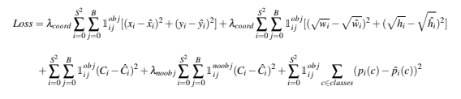

# Object Detection with Simplified YOLO

* Dewang Sultania
  * [LinkedIn](https://www.linkedin.com/in/dewang-sultania/)
* Tested on: Ubuntu 18.04, Intel Xeon E-2176M @ 2.70GHz 16GB, Quadro P2000 4GB (Personal Computer)
* Dependencies: pytorch, tensorflow(tensorboard), numpy, scikit, matplotlib

### Table of Contents
1. [Introduction](#intro)
2.   [Data Preprocessing](#pre)
3.   [Model Architecture](#arch)
4.   [Training Details](#training)
5.   [Post Processing](#posr)  
6.   [Results](#results)
7. 	 [Run Instructions](#run)

<a name = "intro"/>

## Introduction

Object detection is a fundamental task in computer vision. The problem of object recognition essentially consists of first localizing the object and the classifying with a semantic label. In recent deep learning based methods, YOLO is an extremely fast real time multi object detection algorithm.

The repository contains code for object detection using YOLO. There are 10K street scene images, with corresponding labels as training data. The image dimensions are 128*128*3 and labels include semantic class and bounding box corresponding to each object in the image. 

<a name = "pre"/>

## Data Preprocessing


The given format of the labels was (class, x1, y1, x2, y2) where  where x1, y1 are the top left corner of the bounding box and x2, y2 are the bottom right corner of the bounding box.  For each image the provided labels were converted to a 8X8X8 ground truth matrix, which has the same dimension  as the output of YOLO detection network. The instruction of this conversion is as follows: 

- We consider a 16x16 image patch as a grid cell and thus divide the full image into 8x8 patches in the 2D spatial dimension. In the output activation space, one grid cell represents one 16x16 image patch with corresponding aligned locations. 
- For simplied YOLO, we only use one anchor box, where we assume the anchor size is the same as the grid cell size. If the center of an object falls into a grid cell, that grid cell is responsible for detecting that object. This means that there is only one anchor for each object instance. 
- For each anchor, there are 8 channels, which encode Pr(Objectness), x, y, w, h, P(class=pedestrian), P(class=traffic light), and P(class=car). 
- The Pr(Objectness) is the probability of whether this anchor is an object or background. When assigning the ground-truth for this value, "1" indicates object and "0" indicates background. 
- The channels 2-5, x, y indicate the offset to the center of anchor box; w, h is the relative scale of the image width and height. 
- In channels 6-8, you need to convert the ground truth semantic label of each object into one-hot coding for each anchor boxes. 
- Note that if the anchor box does not have any object (Pr=0), you don’t need to assign any values to channels 2-8, since we will not use them during training. 

| Ground Truth       | Channels                    |
| ------------------ | --------------------------- |
|  |  |

<a name = "arch"/>

## Model Architecture

The model takes input with dimension of 128X128X3 and outputs an activation with dimension 8X8X8.


<a name = "training"/>

## Training Details

During training, the localization and classification errors are optimized jointly. The loss function is shown as below. i indicates number of grid cells and j indicates number of anchor boxes at each grid cell. In our case, there is only one anchor box at each grid cell and B = 1. 



<a name = "posr"/>

## Post-Processing

During inference, the network is going to predict lots of overlapping redundant bounding boxes. To eliminate the redundant boxes, there are basically two steps: 

-  Get rid of predicted boxes with low objectness probability (Pc < 0.6). 
-  After the first step, for each class, run IoU for all the bounding boxes and cluster boxes with IoU > 0.5 as a group. For each group, find the one with highest Pc and suppress the other boxes. This is referred as non-max suppression. 


<a name = "results"/>


## Results


<a name = "run"/>

## Run Instructions

- Download the images and labels from here:
  - https://drive.google.com/open?id=1jIKQLhTHZUE6m2mE5lRKMSqN7ZGK2Gyu
  - https://drive.google.com/open?id=1Gth_AVG5t-4ZhH_whOaXwe0PBXNhIIK0
- Download the model from here:
  - https://drive.google.com/file/d/1Oed91n7DKPdR0PwX_Y_hL0UGJMzYPO-P/view?usp=sharing
- Run the file main.py
- To view the plots run tensorboard using the command ```tensorboard --logdir 'logs' --host 0.0.0.0 --port 6006 &``` on the terminal and then goto, localhost:6006
